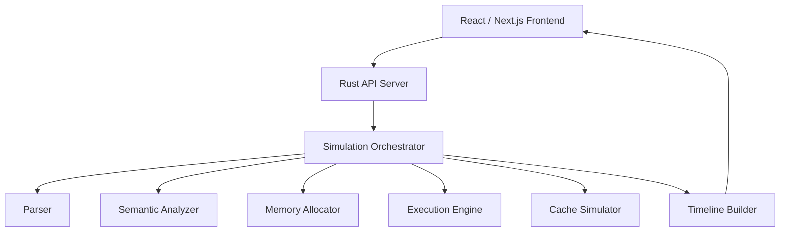
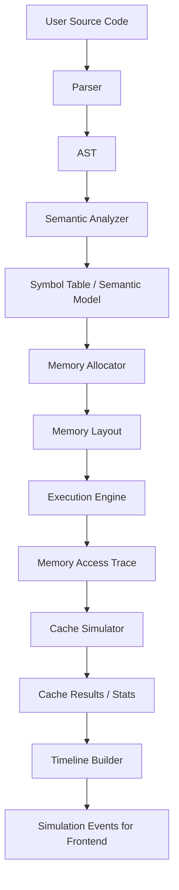
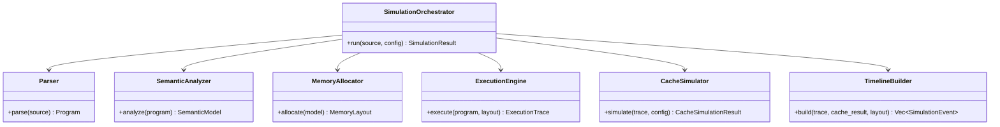
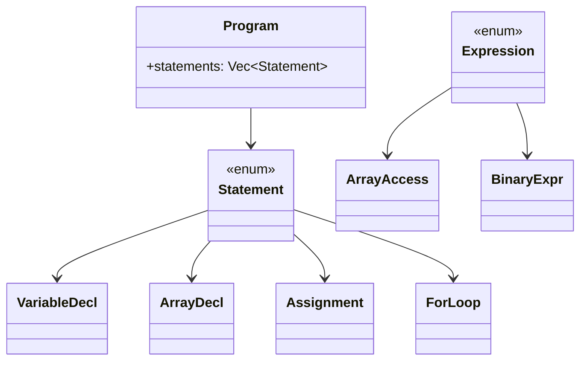
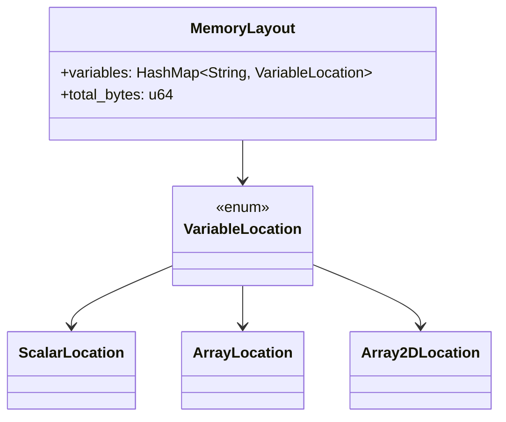
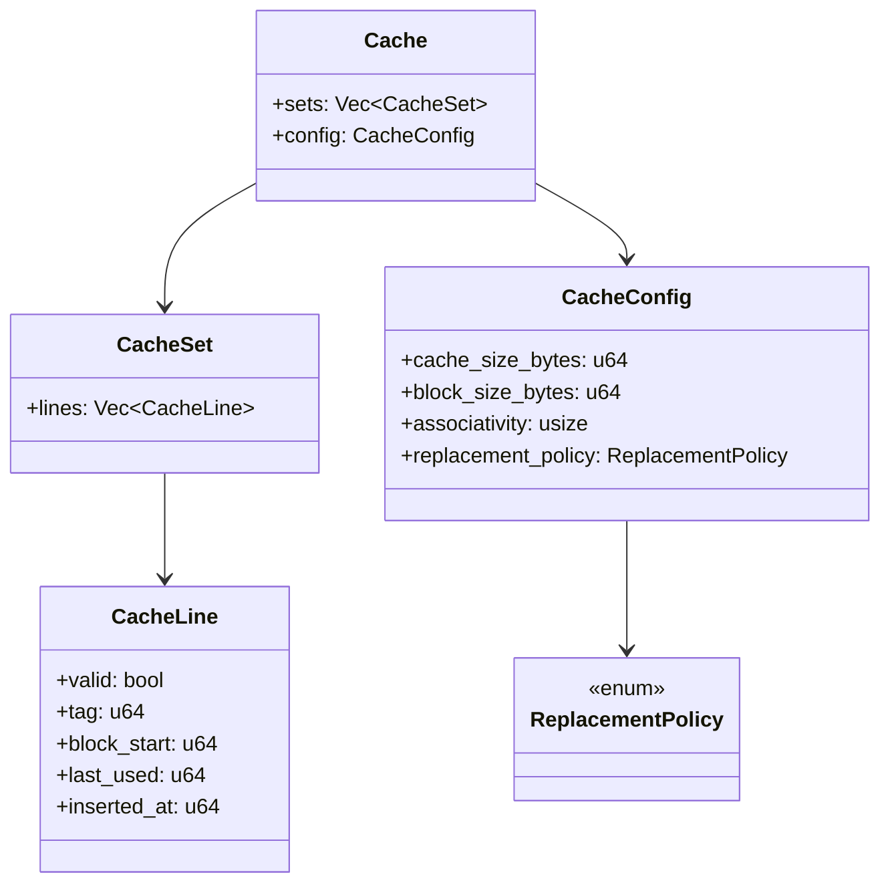
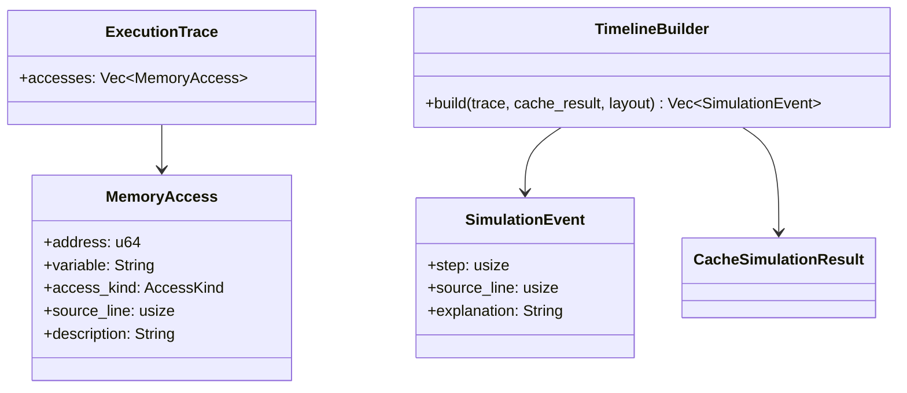
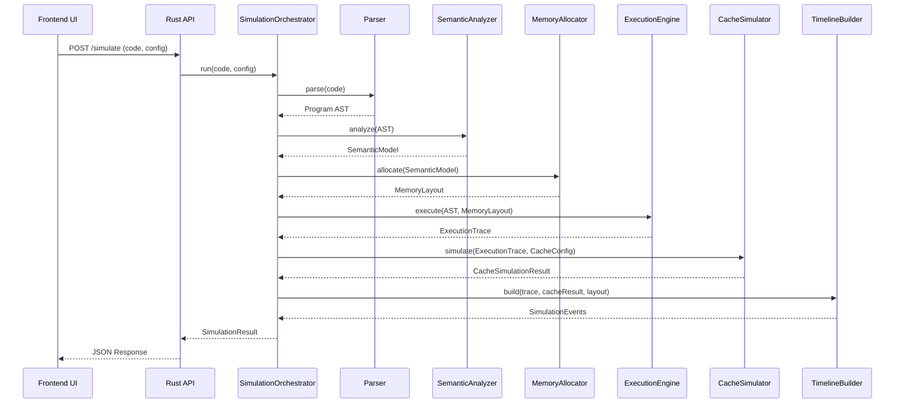

# CacheViz Rust Architecture Pack

## 1. System Overview

CacheViz is an educational cache visualiser built with a **Rust simulation core** and a **React/Next.js frontend**.

### Main flow
1. User writes simplified C-like code.
2. User selects cache configuration.
3. Frontend sends source code + config to Rust backend.
4. Rust backend parses the code, builds a memory layout, generates memory accesses, simulates cache behaviour, and returns a step-by-step event timeline.
5. Frontend visualises code execution, memory activity, and cache state.

---

## 2. High-Level Architecture



---

## 3. Execution Pipeline



---

## 4. Core Rust Module Diagram



---

## 5. AST Design



### Suggested Rust shape
```rust
pub struct Program {
    pub statements: Vec<Statement>,
}

pub enum Statement {
    VariableDecl(VariableDecl),
    ArrayDecl(ArrayDecl),
    Assignment(Assignment),
    ForLoop(ForLoop),
}

pub enum Expression {
    Literal(i64),
    Identifier(String),
    Binary(Box<BinaryExpr>),
    ArrayAccess(ArrayAccess),
}
```

---

## 6. Memory Model Diagram



### Suggested Rust shape
```rust
pub struct MemoryLayout {
    pub variables: std::collections::HashMap<String, VariableLocation>,
    pub total_bytes: u64,
}

pub enum VariableLocation {
    Scalar(ScalarLocation),
    Array(ArrayLocation),
    Array2D(Array2DLocation),
}
```

---

## 7. Cache Model Diagram



### Suggested Rust shape
```rust
pub struct CacheConfig {
    pub cache_size_bytes: u64,
    pub block_size_bytes: u64,
    pub associativity: usize,
    pub replacement_policy: ReplacementPolicy,
}

pub struct Cache {
    pub sets: Vec<CacheSet>,
    pub config: CacheConfig,
}

pub struct CacheSet {
    pub lines: Vec<CacheLine>,
}

pub struct CacheLine {
    pub valid: bool,
    pub tag: u64,
    pub block_start: u64,
    pub last_used: u64,
    pub inserted_at: u64,
}

pub enum ReplacementPolicy {
    Lru,
    Fifo,
    Random,
}
```

---

## 8. Trace and Timeline Diagram



### Suggested Rust shape
```rust
pub struct MemoryAccess {
    pub address: u64,
    pub variable: String,
    pub access_kind: AccessKind,
    pub source_line: usize,
    pub description: String,
}

pub struct ExecutionTrace {
    pub accesses: Vec<MemoryAccess>,
}

pub struct SimulationEvent {
    pub step: usize,
    pub source_line: usize,
    pub explanation: String,
}
```

---

## 9. Sequence Diagram



---

## 10. Recommended Rust Workspace Layout

```text
cacheviz/
├── frontend/
│   ├── package.json
│   └── src/
├── backend/
│   ├── Cargo.toml
│   └── src/
│       ├── main.rs
│       ├── api/
│       │   ├── mod.rs
│       │   ├── routes.rs
│       │   └── dto.rs
│       ├── core/
│       │   ├── mod.rs
│       │   ├── orchestrator.rs
│       │   └── session.rs
│       ├── parser/
│       │   ├── mod.rs
│       │   ├── lexer.rs
│       │   ├── parser.rs
│       │   ├── ast.rs
│       │   └── token.rs
│       ├── semantic/
│       │   ├── mod.rs
│       │   ├── analyzer.rs
│       │   ├── symbol_table.rs
│       │   └── types.rs
│       ├── memory/
│       │   ├── mod.rs
│       │   ├── allocator.rs
│       │   ├── model.rs
│       │   ├── layout.rs
│       │   └── address.rs
│       ├── execution/
│       │   ├── mod.rs
│       │   ├── engine.rs
│       │   ├── context.rs
│       │   ├── values.rs
│       │   └── tracer.rs
│       ├── cache/
│       │   ├── mod.rs
│       │   ├── simulator.rs
│       │   ├── cache.rs
│       │   ├── set.rs
│       │   ├── line.rs
│       │   ├── decoder.rs
│       │   ├── policy.rs
│       │   └── stats.rs
│       └── timeline/
│           ├── mod.rs
│           ├── event.rs
│           └── builder.rs
```

---

## 11. Starter Rust Skeleton

### `backend/src/main.rs`
```rust
mod api;
mod cache;
mod core;
mod execution;
mod memory;
mod parser;
mod semantic;
mod timeline;

use axum::{routing::post, Router};
use std::net::SocketAddr;

#[tokio::main]
async fn main() {
    let app = Router::new()
        .route("/simulate", post(api::routes::simulate));

    let addr = SocketAddr::from(([127, 0, 0, 1], 3001));
    println!("Server running on http://{}", addr);

    let listener = tokio::net::TcpListener::bind(addr).await.unwrap();
    axum::serve(listener, app).await.unwrap();
}
```

### `backend/src/core/orchestrator.rs`
```rust
use crate::cache::simulator::CacheSimulator;
use crate::execution::engine::ExecutionEngine;
use crate::memory::allocator::MemoryAllocator;
use crate::parser::parser::Parser;
use crate::semantic::analyzer::SemanticAnalyzer;
use crate::timeline::builder::TimelineBuilder;

pub struct SimulationOrchestrator {
    parser: Parser,
    analyzer: SemanticAnalyzer,
    allocator: MemoryAllocator,
    engine: ExecutionEngine,
    cache_simulator: CacheSimulator,
    timeline_builder: TimelineBuilder,
}

impl SimulationOrchestrator {
    pub fn new() -> Self {
        Self {
            parser: Parser::new(),
            analyzer: SemanticAnalyzer::new(),
            allocator: MemoryAllocator::new(1000, 4),
            engine: ExecutionEngine::new(),
            cache_simulator: CacheSimulator::new(),
            timeline_builder: TimelineBuilder::new(),
        }
    }
}
```

### `backend/src/parser/ast.rs`
```rust
#[derive(Debug, Clone)]
pub struct Program {
    pub statements: Vec<Statement>,
}

#[derive(Debug, Clone)]
pub enum Statement {
    VariableDecl(VariableDecl),
    ArrayDecl(ArrayDecl),
    Assignment(Assignment),
    ForLoop(ForLoop),
}

#[derive(Debug, Clone)]
pub enum Expression {
    Literal(i64),
    Identifier(String),
    ArrayAccess(ArrayAccess),
    Binary(Box<BinaryExpr>),
}

#[derive(Debug, Clone)]
pub struct VariableDecl {
    pub name: String,
}

#[derive(Debug, Clone)]
pub struct ArrayDecl {
    pub name: String,
    pub dimensions: Vec<usize>,
}

#[derive(Debug, Clone)]
pub struct Assignment {
    pub target: Expression,
    pub value: Expression,
}

#[derive(Debug, Clone)]
pub struct ForLoop {
    pub iterator: String,
    pub start: Expression,
    pub end: Expression,
    pub body: Vec<Statement>,
}

#[derive(Debug, Clone)]
pub struct ArrayAccess {
    pub array_name: String,
    pub indices: Vec<Expression>,
}

#[derive(Debug, Clone)]
pub struct BinaryExpr {
    pub left: Expression,
    pub op: String,
    pub right: Expression,
}
```

### `backend/src/cache/policy.rs`
```rust
#[derive(Debug, Clone, Copy)]
pub enum ReplacementPolicy {
    Lru,
    Fifo,
    Random,
}
```

### `backend/src/cache/simulator.rs`
```rust
use crate::cache::policy::ReplacementPolicy;

#[derive(Debug, Clone)]
pub struct CacheConfig {
    pub cache_size_bytes: u64,
    pub block_size_bytes: u64,
    pub associativity: usize,
    pub replacement_policy: ReplacementPolicy,
}

pub struct CacheSimulator;

impl CacheSimulator {
    pub fn new() -> Self {
        Self
    }
}
```

---

## 12. Best MVP Scope

Build this first:
- simplified C-like syntax
- scalar + 1D arrays + 2D arrays
- for loops
- memory layout generation
- access trace generation
- direct-mapped cache
- then 2-way set associative
- hit/miss event timeline

Leave these for later:
- pointers
- functions
- structs
- full C parsing
- advanced write policies

---

## 13. Suggested API Contract

### Request
```json
{
  "sourceCode": "int A[8]; for (int i = 0; i < 8; i++) { sum += A[i]; }",
  "cacheConfig": {
    "cacheSizeBytes": 64,
    "blockSizeBytes": 16,
    "associativity": 2,
    "replacementPolicy": "Lru"
  }
}
```

### Response
```json
{
  "events": [],
  "stats": {
    "hits": 0,
    "misses": 0,
    "hitRate": 0.0
  },
  "memoryLayout": {},
  "variables": []
}
```

---

## 14. Recommended Next Build Order

1. AST + parser
2. Symbol table + semantic analysis
3. Memory allocator
4. Execution trace generator
5. Direct-mapped cache simulator
6. Timeline event generation
7. Axum API
8. React visualiser

